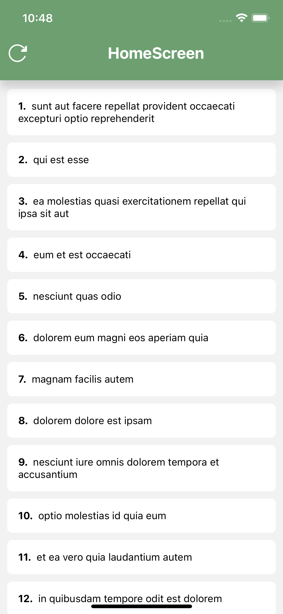
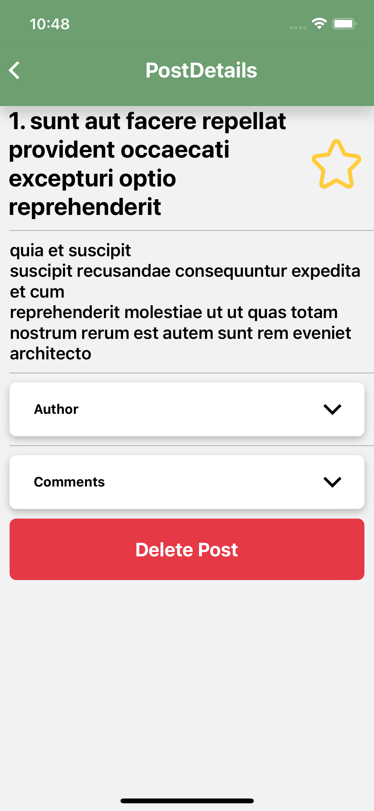
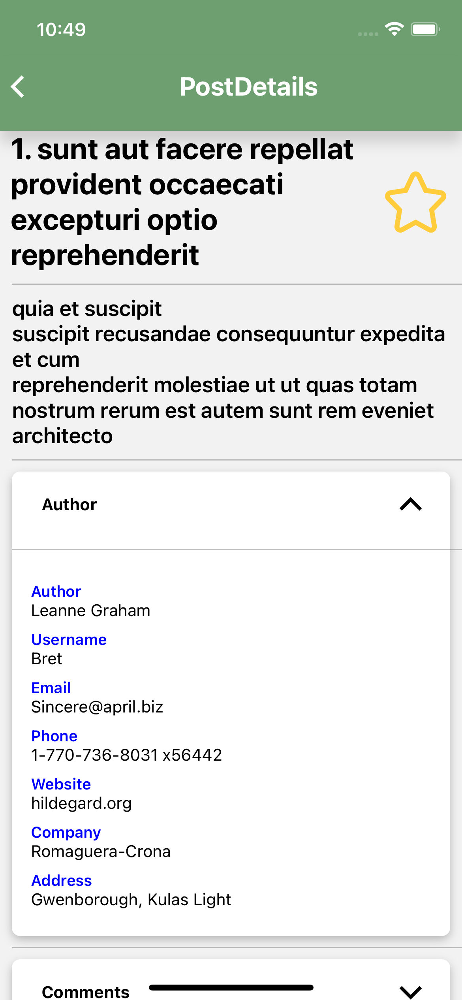
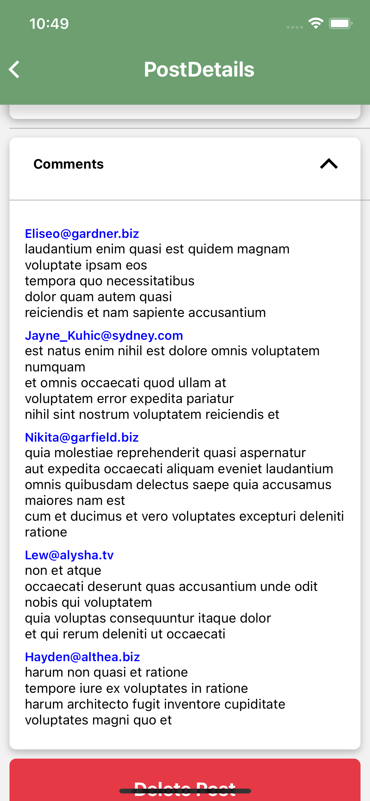
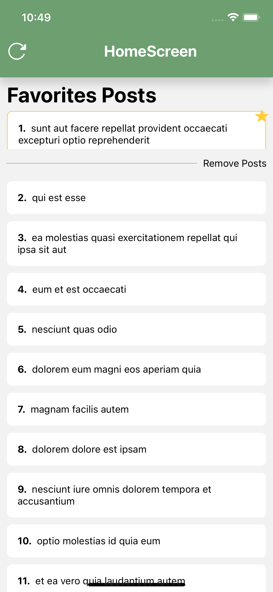
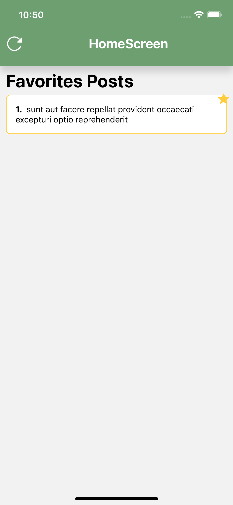

# ZemogaMobileTest

This is a mobile app built with React Native for Android and iOS using TypeScript.

## Table of Content:

- [About The App](#about-the-app)
- [Screenshots](#screenshots)
- [Technologies](#technologies)
- [Setup](#setup)
- [Approach](#approach)
- [Status](#status)
- [Credits](#credits)
- [License](#license)

## About The App

The purpose of this app is to complete a Mobile Tech Test for being considered for a Mobile developer role. The app is built with React Native for iOS and Android devices and uses the JSONPlaceholder API.

## Screenshots

<div style="flex-wrap: wrap;">
    
    
    
    
    
    
</div>

## Technologies

For this project the technologies which have been used:

- [React Native: Get Started](https://reactnative.dev/docs/environment-setup)

- [React Navigation: Get Started](https://reactnavigation.org/docs/getting-started)

- [Redux](https://redux.js.org/introduction/getting-started)

## Setup

**Step 1:**

Download or clone this repository using the following link:

```
https://github.com/pablo596/ZemogaMobileTest.git
```

**Step 2:**

Go to the root of the project and run the following command in the console to get the required dependencies:

**_Depending on the package manager perform the following commands:_**

**_YARN_**

```
yarn
```

**_NPM_**

```
npm install
```

**Step 3:**

In the terminal, go to the root of the project and run the following command to run the app on the connected android device.

**_YARN_**

For Android

```
yarn android
```

For iOS

```
yarn ios
```

**_NPM_**

For Android

```
npx react-native run-android
```

For iOS

```
npx react-native run-ios
```

## App Features:

### Screens

- HomeScreen: `The HomeScreen shows all posts loaded from the API`

- PostDetail: `The PostDetail shows the detail of the post previously selected from HomeScreen, showing Post name, description, author detail, and comment list, and has a star button to toggle the post for favorite.`

### Estructura del proyecto

Here is the main folder structure that React Native provides.

```
ZemogaMobileTest/
|- android/
|- ios/
|- lib/
|- vendor/
|- assets/
```

Here is the folder structure that has been used in this project.

```
ZemogaMobileTest
|- src/
   |- components/
   |- hooks/
   |- interfaces/
   |- navigator/
   |- page/
   |- store/
   |- theme/
```

Ahora un pequeño resumen de lo que contiene cada carpeta creada para el proyecto.

```
1. components - Here all the components created are stored so that they can be reused in the application.
2. hooks - Custom hooks are stored here.
3. interfaces - Here the types of data are stored according to the needs of the app.
4. navigator - Here the configuration of the routes and the navigation of the app are stored.
5. pages - The main components or screens that are displayed in the application are stored here.
6. store - Here the management of the state is stored using redux.
7. theme - Style data is stored here that can be reused in the application.

```
